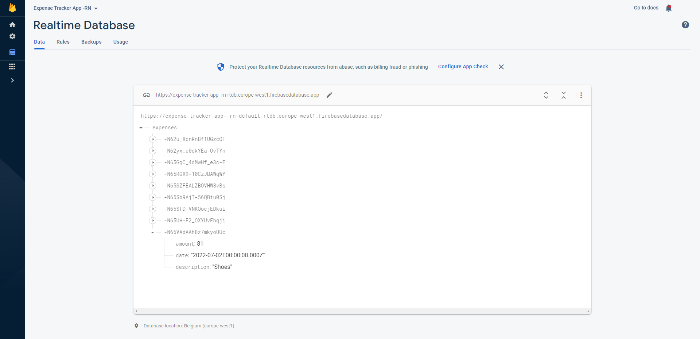
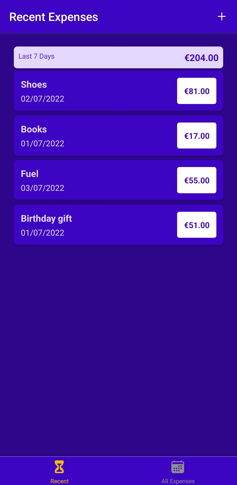
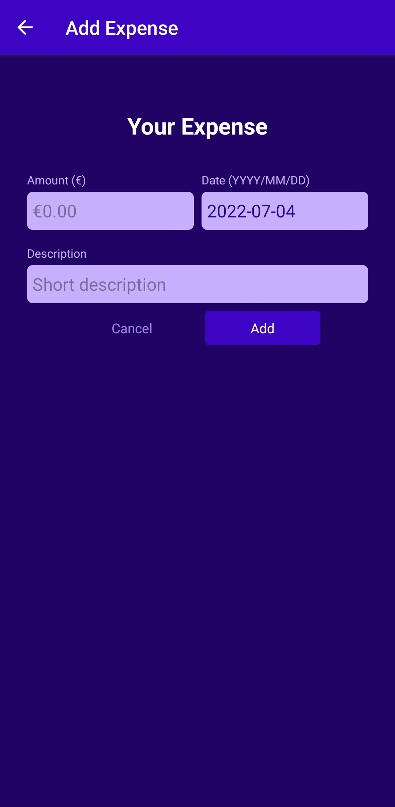
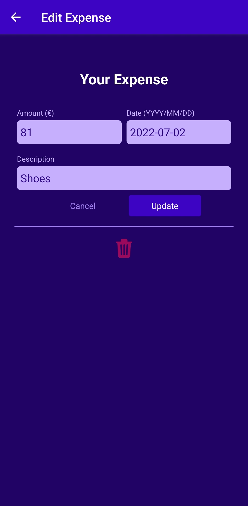

# Expense Tracker Application — React Native

> Expense tracker with backend in Firebase using "ReadTime Database".

Google automatically creates a REST API that 'sits in front of the database' but the app will handle requests to the database directly, which then inturn firebase translates to requests behind the scenes.

# Table of Contents

- [Expense Tracker Application — React Native](#expense-tracker-application--react-native)
- [Table of Contents](#table-of-contents)
- [Instructions](#instructions)
- [Packages](#packages)
- [Firebase 'RealTime' backend database](#firebase-realtime-backend-database)
- [Application Images](#application-images)
- [Home (Recent Expenses)](#home-recent-expenses)
- [All Expenses](#all-expenses)
- [Add Expense](#add-expense)
- [Edit Expense](#edit-expense)

# Instructions

- Clone repo
- Install dependencies by running `npm install`
- Create a Realtime Database Project on [Google Firebase](https://console.firebase.google.com/u/0/)
  - Add connection string to `http.js`
- Run `expo start` to run the application using [Expo](https://expo.dev/)
- Download the [Expo Go](https://expo.dev/) App for iOS/Android on the App Store/Google Play
- Scan the QR code on the terminal to launch the App in Development Mode on your phone

# Packages

```
├── @babel/core@7.18.6
├── @react-navigation/bottom-tabs@6.3.1
├── @react-navigation/material-bottom-tabs@6.2.1
├── @react-navigation/native-stack@6.6.2
├── @react-navigation/native@6.0.10
├── @react-navigation/stack@6.2.1
├── axios@0.27.2
├── expo-status-bar@1.3.0
├── expo@45.0.6
├── react-dom@17.0.2
├── react-native-gesture-handler@2.2.1
├── react-native-paper@4.12.2
├── react-native-safe-area-context@4.2.4
├── react-native-screens@3.11.1
├── react-native-vector-icons@9.2.0
├── react-native-web@0.17.7
├── react-native@0.68.2
└── react@17.0.2
```

# Firebase 'RealTime' backend database

<p align="center" >
 
</p>

> Simple database rule used used during development

```json
{
  "rules": {
    ".read": "now < 1659308400000", // 2022-8-1
    ".write": "now < 1659308400000" // 2022-8-1
  }
}
```

# Application Images

# Home (Recent Expenses)

> Recent expenses are expenses that have been logged within the last 7 days

<p align="center" >
 
</p>

# All Expenses

<p align="center" >
 
</p>

# Add Expense

<p align="center" >
 
</p>

# Edit Expense

<p align="center" >
 
</p>
